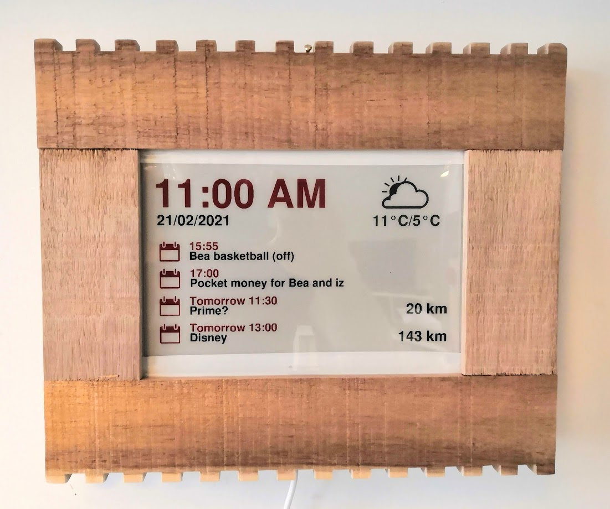

Instructions on setting up a Raspberry Pi Zero WH with a Waveshare ePaper 7.5 Inch HAT. 
The screen will display date, time, weather icon with high and low, calendar entries, and
data scraped from HomeAssistant.

This is a fork of [mendhak's original](https://github.com/mendhak/waveshare-epaper-display) repo, with the following
customisations:

* Support the 3-colour red/black/white epd7in5b_V2 e-paper screen
* Scrape values from HomeAssistant
* Use my preferred screen template
* Always refresh the screen fully on (hourly) updates, to accomodate the 3-colour screen's limitations

## Shopping list

[Waveshare 7.5 inch epaper display HAT 800x480, Red/Black/White](https://www.waveshare.com/product/displays/e-paper/epaper-1/7.5inch-e-paper-hat-b.htm)
[Raspberry Pi Zero WH (presoldered header)](https://www.amazon.co.uk/gp/product/B07BHMRTTY/)  
[microSDHC card](https://www.amazon.co.uk/gp/product/B073K14CVB)

## Setup the PI

(jm: these instructions are verbatim from [mendhak's original](https://github.com/mendhak/waveshare-epaper-display); I used a Raspberry Pi 4 with a little more CPU power.)

### Prepare the Pi

I've got a separate post for this, [prepare the Raspberry Pi with WiFi and SSH](https://code.mendhak.com/prepare-raspberry-pi/).  Once the Pi is set up, and you can access it, come back here. 

### Connect the display

Turn the Pi off, then put the HAT on top of the Pi's GPIO pins.  

Connect the ribbon from the epaper display to the extension.  To do this you will need to lift the black latch at the back of the connector, insert the ribbon slowly, then push the latch down.  Now turn the Pi back on. 

## Setup dependencies

    sudo apt install git ttf-wqy-zenhei ttf-wqy-microhei python3 python3-pip python-imaging libopenjp2-7-dev libjpeg8-dev inkscape figlet wiringpi netpbm
    sudo pip3 install astral spidev RPi.GPIO Pillow  # Pillow took multiple attempts to install as it's always missing dependencies
    sudo pip3 install --upgrade google-api-python-client google-auth-httplib2 google-auth-oauthlib msal
    sudo sed -i s/#dtparam=spi=on/dtparam=spi=on/ /boot/config.txt  #This enables SPI
    sudo reboot

### Get the BCM2835 driver

    wget http://www.airspayce.com/mikem/bcm2835/bcm2835-1.58.tar.gz
    sudo tar zxvf bcm2835-1.58.tar.gz
    cd bcm2835-1.58/
    sudo ./configure
    sudo make
    sudo make check
    sudo make install

## Using this application

### Clone it

git clone this repository in the `/home/pi` directory.

    cd /home/pi
    git clone --recursive https://github.com/jmason/waveshare-epaper-display.git
    
This should create a `/home/pi/waveshare-epaper-display` directory. 

### Waveshare version

Copy `env.sh.sample` (example environment variables) to `env.sh` 

Modify the `env.sh` file and set the version of your Waveshare 7.5" e-Paper Module  (newer ones are version 2)

    export WAVESHARE_EPD75_VERSION=2

## Pick a Weather provider

You can pick between OpenWeatherMap, Met Office, AccuWeather, Met.no and Climacell to provide temperature and weather forecasts.  
You can switch between them too, by providing the keys and commenting out other ones, but remember to delete the `weather-cache.json` if you switch weather providers. 

### OpenWeatherMap

Register on the [OpenWeathermap](https://openweathermap.org) website, and go to the [API Keys page](https://home.openweathermap.org/api_keys), that's the key you'll need. 
Add it to the env.sh file.  

    export OPENWEATHERMAP_APIKEY=xxxxxx

### Met Office (UK)

Create an account [on the Met Office Weather DataHub](https://metoffice.apiconnect.ibmcloud.com/metoffice/production/) site.  
Next, [register an application](https://metoffice.apiconnect.ibmcloud.com/metoffice/production/application) - just call it Raspberry Pi or Home Project.  
You'll be shown a Client Secret, and a Client ID.  Copy both of these somewhere, you'll need it later.  

After registering an application, you then "subscribe" to an API by going to the [API Usage Plans](https://metoffice.apiconnect.ibmcloud.com/metoffice/production/product).  
Pick "Global spot data bundle" which includes the "Global daily spot data" API. 
Choose the Basic (free) plan and when prompted, pick that application you previously registered.  

Finally, add the Met Office Client ID and Secret to the env.sh file. 

    export METOFFICEDATAHUB_CLIENT_ID=xxxxxx-xxxxxx-....
    export METOFFICEDATAHUB_CLIENT_SECRET=xxxxxx

### AccuWeather

Register on the [AccuWeather](https://developer.accuweather.com/) site.  
Next, [register a new application](https://developer.accuweather.com/user/me/apps).  
I just named it Personal, marked it as Limited Trial, Internal App, Business to Consumer. 
Once you do this you'll get an API Key, save it. 

You'll also need an AccuWeather Location Key.  
Do a normal [AccuWeather search](https://www.accuweather.com/) for your location.  
The last number in the URL is the Location Key.  In the example of [London](https://www.accuweather.com/en/gb/london/ec4a-2/weather-forecast/328328), it's `328328`. 

Add the API Key and Location Key to the `env.sh`. 

    export ACCUWEATHER_APIKEY=xxxxxx
    export ACCUWEATHER_LOCATIONKEY=328328

### Met.no

Met.no's [Terms of Service](https://api.met.no/doc/TermsOfService) requires you to identify yourself.  The purpose is to ensure they can contact you in case you overload or abuse their servers.  For this reason, you just need to set your email address in `env.sh` like so:

    export METNO_SELF_IDENTIFICATION=you@example.com

Note that the Met.no API provides 6 hours of forecast, rather than a full day.  

### Climacell (tomorrow.io)

Register on the [Climacell site](https://www.climacell.co/weather-api/), and when you do you should be given an API Key.   
Modify the `env.sh` file and put your Climacell API key in there.  

    export CLIMACELL_APIKEY=xxxxxx

### Location information for Weather

Whichever weather provider you've picked, you'll need to provide the location and units to display in.  

Modify the `env.sh` file and update with the latitude and longitude of your location.  
As needed, change the temperature format (CELSIUS or FAHRENHEIT).  

    export WEATHER_LATITUDE=51.3656
    export WEATHER_LONGITUDE=0.1963
    export WEATHER_FORMAT=CELSIUS

## Pick a Calendar provider

You can use Google Calendar or Outlook Calendar to display events.  

### Google Calendar token

The Oauth process needs to complete once manually in order to allow the Python code to then continuously query Google Calendar for information. 
Go to the [Python Quickstart](https://developers.google.com/calendar/quickstart/python) page and enable Google Calendar API.  When presented, download or copy the `credentials.json` file and add it to this directory. 

Next, SSH to the Raspberry Pi and run

    python3 screen-calendar-get.py

The script will prompt you to visit a URL in your browser and then wait.  Copy the URL, open it in a browser and you will go through the login process.  When the OAuth workflow tries to redirect back (and fails), copy the URL it was trying to go to (eg: http://localhost:8080/...) and in another SSH session with the Raspberry Pi, 

    curl "http://localhost:8080/..." 

On the first screen you should see the auth flow complete, and a new `token.pickle` file appears.  The Python script should now be able to run in the future without prompting required.  

I also have a [post here with screenshots](https://github.com/mendhak/waveshare-epaper-display/issues/19#issuecomment-780397819) walking through the process. 

### Outlook Calendar

The setup is much simpler, just run this script which will give instructions on how to login:

    python3 outlook_util.py

Login with the Microsoft account you want to get the calendar from, and accept the consent screen.    
After a moment, the script will then display a set of Calendar IDs and some sample events from those Calendars.   
Copy the ID of the calendar you want, and add it to env.sh like so: 

    export OUTLOOK_CALENDAR_ID=AQMkAxyz...

Note that if you set an Outlook Calendar ID, the Google Calendar will be ignored.  

### HomeAssistant settings

Modify the `env.sh` file and update with the URL of your local HomeAssistant installation:

    export HASS_URL='http://your.local.homeassistant.url:8123/'

Create a long-lived access token in the HomeAssistant UI for this script to use to access it; see https://developers.home-assistant.io/docs/auth_api/#long-lived-access-token for details.  Paste the value here:

    export HASS_BEARER_TOKEN=xxxxxxxx

Pick whichever sensors you plan to use (in my case the battery levels of the two household electric cars), and the template strings which their values will be inserted into in the InkScape SVG template:

    export HASS_SENSORS='{
        "sensor.car1_range_electric":"HCR_1",
        "sensor.car2_range":"HCR_2"
    }'

Run `./run.sh` which should query the weather provider, HomeAssistant and Google/Outlook Calendar.  It will then create a png, convert to a pair of 1-bit bmps for black/white and black/red layers, then display the bmp on screen. 

Unfortunately, the red/black/white 7.5 inch display has a very slow refresh time, about 30 seconds, and doesn't support any kind of partial refresh at the moment.

### Automate it

Once you've proven that the run works, and an image is sent to your epaper display, you can automate it by setting up a cronjob.  

    crontab -e

Add this entry so it runs every hour:

    0 * * * * cd /home/pi/waveshare-epaper-display; bash run.sh

This will cause the script to run every hour, and write the output as well as errors to a file called LOG.  You can potentially
run this more frequently, but note that every refresh involves 30 seconds of screen flashing, which is quite intrusive.

## Troubleshooting

If the scripts don't work at all, try going through the Waveshare sample code linked below - if you can get those working, this script should work for you too. 

You may want to further troubleshoot if you're seeing or not seeing something expected.  
If you've set up the cron job as shown above, a `run.log` file will appear which contains some info and errors.  
If there isn't enough information in there, you can set `export LOG_LEVEL=DEBUG` in the `env.sh` and the `run.log` will contain even more information.  

The scripts cache the calendar and weather information, to avoid hitting weather API rate limits.   
If you want to force a weather update, you can delete the `weather-cache.json`.   
If you want to force a calendar update, you can delete the `calendar.pickle` or `outlookcalendar.pickle`.   
If you want to force a re-login to Google or Outlook, delete the `token.pickle` or `outlooktoken.bin`.  

## Waveshare documentation and sample code

Waveshare have a [user manual](https://www.waveshare.com/w/upload/7/74/7.5inch-e-paper-hat-user-manual-en.pdf) which you can get to from [their Wiki](https://www.waveshare.com/wiki/7.5inch_e-Paper_HAT)

The [Waveshare demo repo is here](https://github.com/waveshare/e-Paper).  Assuming all dependencies are installed, these demos should work.  

    git clone https://github.com/waveshare/e-Paper
    cd e-Paper

This is the best place to start for troubleshooting - try to make sure the examples given in their repo works for you. 

[Readme for the C demo](https://github.com/waveshare/e-Paper/blob/master/RaspberryPi_JetsonNano/c/readme_EN.txt)

[Readme for the Python demo](https://github.com/waveshare/e-Paper/blob/master/RaspberryPi_JetsonNano/python/readme_jetson_EN.txt)

