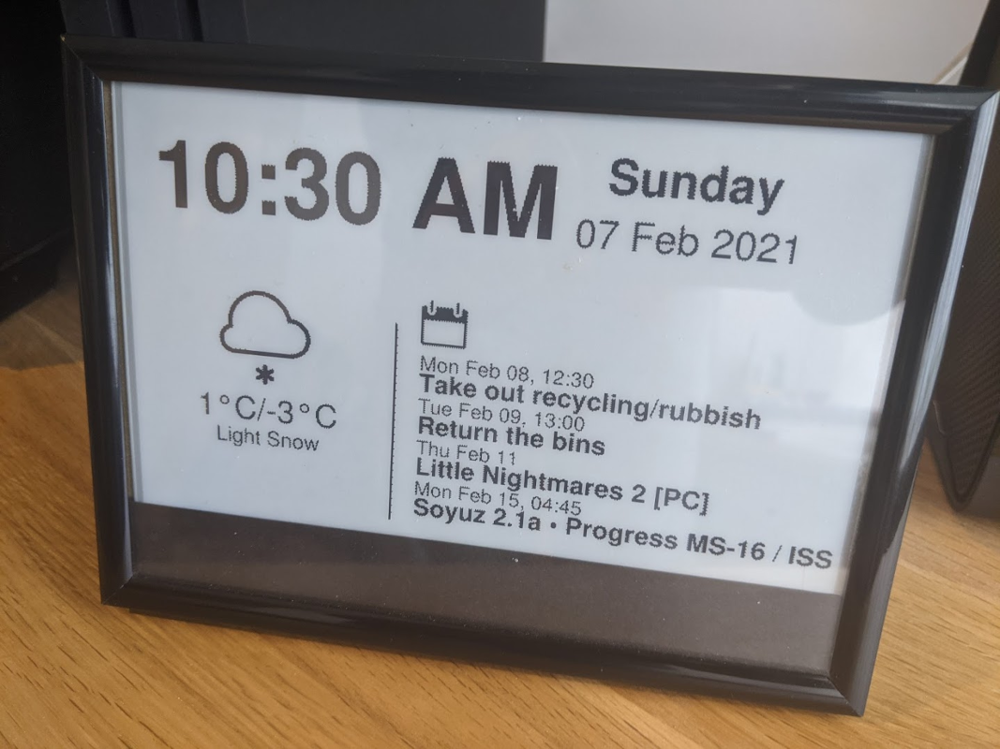
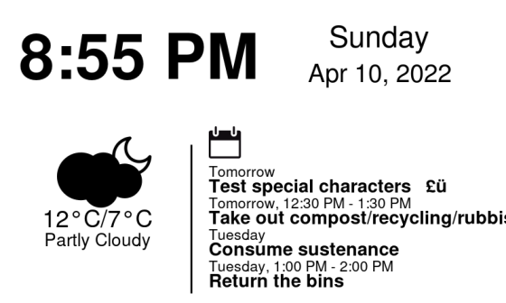
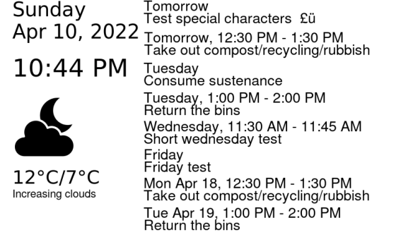
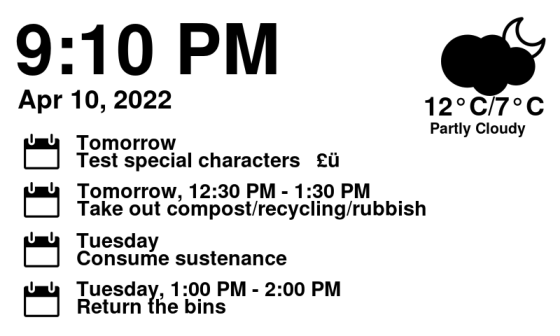
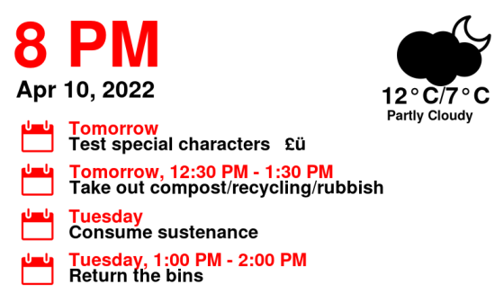

Instructions on setting up a Raspberry Pi Zero WH with a Waveshare ePaper 7.5 Inch HAT. 
The screen will display date, time, weather icon with high and low, and calendar entries.




- [Shopping list](#shopping-list)
- [Setup the PI](#setup-the-pi)
- [Setup dependencies](#setup-dependencies)
- [Using this application](#using-this-application)
- [Set your location](#set-your-location)
- [Pick a Weather provider](#pick-a-weather-provider)
  - [OpenWeatherMap](#openweathermap)
  - [Met Office (UK)](#met-office-uk)
  - [AccuWeather](#accuweather)
  - [Met.no](#metno)
  - [Met Éireann (Ireland)](#met-éireann-ireland)
  - [Weather.gov (US)](#weathergov-us)
  - [Climacell (tomorrow.io)](#climacell-tomorrowio)
  - [VisualCrossing](#visualcrossing)
- [Pick a severe weather warning provider](#pick-a-severe-weather-warning-provider)
  - [Met Office (UK)](#met-office-uk-1)
  - [Weather.gov (US)](#weathergov-us-1)
  - [Met Éireann (Ireland)](#met-éireann-ireland-1)  
- [Pick a Calendar provider](#pick-a-calendar-provider)
  - [Google Calendar setup](#google-calendar-setup)
  - [Outlook Calendar](#outlook-calendar)
- [Pick a layout](#pick-a-layout)
- [Run it](#run-it)
  - [Automate it](#automate-it)
- [Adding custom data](#adding-custom-data)
- [Troubleshooting](#troubleshooting)
- [Waveshare documentation and sample code](#waveshare-documentation-and-sample-code)


## Shopping list

[Waveshare 7.5 inch epaper display HAT 640x384](https://www.amazon.co.uk/gp/product/B075R4QY3L/)  
[Raspberry Pi Zero WH (presoldered header)](https://www.amazon.co.uk/gp/product/B07BHMRTTY/)  
[microSDHC card](https://www.amazon.co.uk/gp/product/B073K14CVB)

## Setup the PI

### Prepare the Pi

I've got a separate post for this, [prepare the Raspberry Pi with WiFi and SSH](https://code.mendhak.com/prepare-raspberry-pi/).  Once the Pi is set up, and you can access it, come back here. 


### Connect the display

Turn the Pi off, then put the HAT on top of the Pi's GPIO pins.  

Connect the ribbon from the epaper display to the extension.  To do this you will need to lift the black latch at the back of the connector, insert the ribbon slowly, then push the latch down.  Now turn the Pi back on. 


## Setup dependencies

    sudo apt update && sudo apt upgrade  
    sudo apt install git gsfonts python3 python3-pip cairosvg pigpio python3-pigpio  
    sudo pip3 install python-dateutil astral spidev RPi.GPIO Pillow google-api-python-client google-auth-httplib2 google-auth-oauthlib msal
    sudo sed -i s/#dtparam=spi=on/dtparam=spi=on/ /boot/config.txt  #This enables SPI
    sudo reboot

## Using this application

### Clone it

git clone this repository in the `/home/pi` directory.

    cd ~
    git clone --recursive https://github.com/mendhak/waveshare-epaper-display.git
    
This should create a `/home/pi/waveshare-epaper-display` directory. 

### Waveshare version

Copy `env.sh.sample` (example environment variables) to `env.sh` 

Modify the `env.sh` file and set the version of your Waveshare 7.5" e-Paper Module  (newer ones are version 2)

    export WAVESHARE_EPD75_VERSION=2

## Set your location

Whichever weather provider you use, you'll need to provide the location and units to display in.  

Modify the `env.sh` file and update with the latitude and longitude of your location.  
As needed, change the temperature format (CELSIUS or FAHRENHEIT).  

    export WEATHER_LATITUDE=51.3656
    export WEATHER_LONGITUDE=0.1963
    export WEATHER_FORMAT=CELSIUS

## Pick a Weather provider

You can pick between OpenWeatherMap, Met Office, AccuWeather, Met.no, Weeather.gov, VisualCrossing, and Climacell to provide temperature and weather forecasts.  
You can switch between them too, by providing the keys and commenting out other ones, but remember to delete the `cache_weather.json` if you switch weather providers. 

### OpenWeatherMap

Register on the [OpenWeathermap](https://openweathermap.org) website, and go to the [API Keys page](https://home.openweathermap.org/api_keys), that's the key you'll need. 
Add it to the env.sh file.  

    export OPENWEATHERMAP_APIKEY=xxxxxx

### Met Office (UK)

Create an account [on the Met Office Weather DataHub](https://metoffice.apiconnect.ibmcloud.com/metoffice/production/) site.  
Next, [register an application](https://metoffice.apiconnect.ibmcloud.com/metoffice/production/application) - just call it Raspberry Pi or Home Project.  
You'll be shown a Client Secret, and a Client ID.  Copy both of these somewhere, you'll need it later.  

After registering an application, you then "subscribe" to an API by going to the [API Usage Plans](https://metoffice.apiconnect.ibmcloud.com/metoffice/production/product).  
Pick "Global spot data bundle" which includes the "Global daily spot data" API. 
Choose the Basic (free) plan and when prompted, pick that application you previously registered.  

Finally, add the Met Office Client ID and Secret to the env.sh file. 

    export METOFFICEDATAHUB_CLIENT_ID=xxxxxx-xxxxxx-....
    export METOFFICEDATAHUB_CLIENT_SECRET=xxxxxx

### AccuWeather

Register on the [AccuWeather](https://developer.accuweather.com/) site.  
Next, [register a new application](https://developer.accuweather.com/user/me/apps).  
I just named it Personal, marked it as Limited Trial, Internal App, Business to Consumer. 
Once you do this you'll get an API Key, save it. 

You'll also need an AccuWeather Location Key.  
Do a normal [AccuWeather search](https://www.accuweather.com/) for your location.  
The last number in the URL is the Location Key.  In the example of [London](https://www.accuweather.com/en/gb/london/ec4a-2/weather-forecast/328328), it's `328328`. 

Add the API Key and Location Key to the `env.sh`. 

    export ACCUWEATHER_APIKEY=xxxxxx
    export ACCUWEATHER_LOCATIONKEY=328328

### Met.no

Met.no's [Terms of Service](https://api.met.no/doc/TermsOfService) requires you to identify yourself.  The purpose is to ensure they can contact you in case you overload or abuse their servers.  For this reason, you just need to set your email address in `env.sh` like so:

    export METNO_SELF_IDENTIFICATION=you@example.com

Note that the Met.no API provides 6 hours of forecast, rather than a full day.  

### Met Éireann (Ireland)

[Met Éireann](https://www.met.ie/) publish their forecast data under a [Creative Commons Attribution 4.0 International license (CC BY 4.0)](https://creativecommons.org/licenses/by/4.0/).  All you need to do to use it is to uncomment this line in `env.sh`:

    export WEATHER_MET_EIREANN=1

Note that a condition of use of this data is that weather alerts be displayed, so ALERT_MET_EIREANN_FEED_URL should be uncommented, too.

### Weather.gov (US)

Weather.gov requires you to [identify your application](https://www.weather.gov/documentation/services-web-api).  This can be any made up string, or an email address. 
Set its value in the `env.sh` as shown:

    export WEATHERGOV_SELF_IDENTIFICATION=you@example.com

Warning: YMMV. During my testing, I found the weather.gov API would start returning errors and then suddenly work again. 

### Climacell (tomorrow.io)

Register on the [Climacell site](https://www.climacell.co/weather-api/), and when you do you should be given an API Key.   
Modify the `env.sh` file and put your Climacell API key in there.  

    export CLIMACELL_APIKEY=xxxxxx

### VisualCrossing

Register on [VisualCrossing](https://www.visualcrossing.com/). Under Account Details, you should be able to generate an API key. Once you have that, simply add it to `env.sh` as shown: 

    export VISUALCROSSING_APIKEY=XXXXXXXXXXXXXXXXXXXXXX


## Pick a severe weather warning provider

This is an optional step.  By doing nothing you simply won't see severe weather warnings.  

### Met Office (UK)

Go to the [Met Office RSS Feeds page](https://www.metoffice.gov.uk/weather/guides/rss) and copy the URL of the RSS feed based on your region.  
Set its value in the `env.sh` as shown below. For example, London would be:

    export ALERT_METOFFICE_FEED_URL=https://www.metoffice.gov.uk/public/data/PWSCache/WarningsRSS/Region/se

### Weather.gov (US)

Weather.gov requires you to [identify your application](https://www.weather.gov/documentation/services-web-api).  This can be any made up string, or an email address. 
Set its value in the `env.sh` as shown: 

    export ALERT_WEATHERGOV_SELF_IDENTIFICATION=you@example.com

This provider will use the same latitude and longitude as specified for the weather provider.  

Warning: YMMV. During my testing, I found the weather.gov API would start returning errors and then suddenly work again. 

### Met Éireann (Ireland)

To use alerts from Met Éireann, visit  https://www.met.ie/Open_Data/json/ and choose the appropriate "warning_EIXX" JSON file for your region, using each county's FIPS code.  This code can be found in the table on http://www.statoids.com/uie.html,
in the pre-2014 section.  For example, this is the file for Dublin:

    export ALERT_MET_EIREANN_FEED_URL=https://www.met.ie/Open_Data/json/warning_EI07.json

## Pick a Calendar provider

You can use Google Calendar or Outlook Calendar to display events.  

### Google Calendar setup

The script will by default get its info from your primary Google Calendar.  If you need to pick a specific calendar you will need its ID.  To get its ID, open up [Google Calendar](https://calendar.google.com) and go to the settings for your preferred calendar.  Under the 'Integrate Calendar' section you will see a Calendar ID which looks like `xyz12345@group.calendar.google.com`.  Set that value in `env.sh`

```bash
export GOOGLE_CALENDAR_ID=xyz12345@group.calendar.google.com
```

#### Google Calendar token

The Oauth process needs to complete once manually in order to allow the Python code to then continuously query Google Calendar for information. 

Go to the [Google Cloud Platform library page](https://console.cloud.google.com/apis/library), search for and enable the [Calendar API](https://console.cloud.google.com/apis/api/calendar-json.googleapis.com/overview).  

Next, head over to the [API Dashboard Credentials page](https://console.cloud.google.com/apis/credentials), and create new credentials of type "OAuth Client ID".  For application type, choose "Desktop app" and give it a name such as "Epaper Display".  When presented, download or copy the `credentials.json` file and add it to this directory. 

You can now kick off the authentication process. On the Raspberry Pi, run: 

    python3 screen-calendar-get.py

The script will prompt you to visit a URL in your browser and then wait.  Copy the URL, open it in a browser and you will go through the login process.  When the OAuth workflow tries to redirect back (and fails), copy the URL it was trying to go to (eg: http://localhost:8080/...) and in another SSH session with the Raspberry Pi, 

    curl "http://localhost:8080/..." 

On the first screen you should see the auth flow complete, and a new `token.pickle` file appears.  The Python script should now be able to run in the future without prompting required.  

I also have a [post here with screenshots](https://github.com/mendhak/waveshare-epaper-display/issues/19#issuecomment-780397819) walking through the process. 

### Outlook Calendar

The setup is much simpler, just run this script which will give instructions on how to login:

    python3 outlook_util.py

Login with the Microsoft account you want to get the calendar from, and accept the consent screen.    
After a moment, the script will then display a set of Calendar IDs and some sample events from those Calendars.   
Copy the ID of the calendar you want, and add it to env.sh like so: 

    export OUTLOOK_CALENDAR_ID=AQMkAxyz...

Note that if you set an Outlook Calendar ID, the Google Calendar will be ignored.  

## Pick a layout

This is an optional step.  There are a few different layouts to choose from.  


| `export SCREEN_LAYOUT=1` <br />This is the default | `export SCREEN_LAYOUT=2` <br />More calendar entries and less emphasis on weather and time | 
| --- | --- | 
| [](screenshots/001.png) | [](screenshots/002.png) | 

| `export SCREEN_LAYOUT=3` <br />Calendar entries on left, less emphasis on weather | `export SCREEN_LAYOUT=4` <br />Shows hour instead of time. Meant for color screens. | 
| --- | --- | 
| [](screenshots/003.png) | [](screenshots/004.png) | 


## Run it

Run `./run.sh` which should query the weather provider and Google/Outlook Calendar.  It will then create a png, convert to a 1-bit black and white bmp, then display the bmp on screen. 

Using a 1-bit, low grade BMP is what allows the screen to refresh relatively quickly. Calling the BCM code to do it takes about 6 seconds. 
Rendering a high quality PNG or JPG and rendering to screen with Python takes about 35 seconds.  

### Automate it

Once you've proven that the run works, and an image is sent to your epaper display, you can automate it by setting up a cronjob.  

    crontab -e

Add this entry so it runs every minute:

    * * * * * cd /home/pi/waveshare-epaper-display && bash run.sh > run.log 2>&1

This will cause the script to run every minute, and write the output as well as errors to the run.log file. 


## Adding custom data

Optionally, it's possible to add your own custom data to the screen. For example this could be API calls, data from Home Assistant, PiHole stats, or something external. 

Rename `screen-custom-get.py.sample` to `screen-custom-get.py`. Do your custom code, and set the value of `custom_value_1` to the value you want to display. Run `./run.sh` and it'll appear on screen. 

Next, modify `screen-custom.svg` and change the various x, y, font size values to adjust its appearance and position. 
You can add more values by adding more SVG elements for custom_value_2, custom_value_3, and so on, and set its value in the `output_dict` in `screen-custom.get.py`.  

## Troubleshooting

If the scripts don't work at all, try going through the Waveshare sample code linked below - if you can get those working, this script should work for you too. 

You may want to further troubleshoot if you're seeing or not seeing something expected.  
If you've set up the cron job as shown above, a `run.log` file will appear which contains some info and errors.  
If there isn't enough information in there, you can set `export LOG_LEVEL=DEBUG` in the `env.sh` and the `run.log` will contain even more information.  

The scripts cache the calendar and weather information, to avoid hitting weather API rate limits.   
If you want to force a weather update, you can delete the `cache_weather.json`.   
If you want to force a calendar update, you can delete the `cache_calendar.pickle` or `cache_outlookcalendar.pickle`.   
If you want to force a re-login to Google or Outlook, delete the `token.pickle` or `outlooktoken.bin`.  


## Waveshare documentation and sample code

Waveshare have a [user manual](https://www.waveshare.com/w/upload/7/74/7.5inch-e-paper-hat-user-manual-en.pdf) which you can get to from [their Wiki](https://www.waveshare.com/wiki/7.5inch_e-Paper_HAT)


The [Waveshare demo repo is here](https://github.com/waveshare/e-Paper).  Assuming all dependencies are installed, these demos should work.  

    git clone https://github.com/waveshare/e-Paper
    cd e-Paper


This is the best place to start for troubleshooting - try to make sure the examples given in their repo works for you. 

[Readme for the C demo](https://github.com/waveshare/e-Paper/blob/master/RaspberryPi_JetsonNano/c/readme_EN.txt)

[Readme for the Python demo](https://github.com/waveshare/e-Paper/blob/master/RaspberryPi_JetsonNano/python/readme_jetson_EN.txt)


